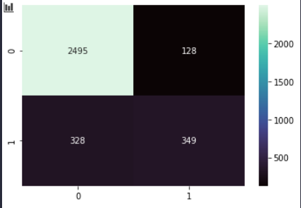

# Brief Simplon - Taux de désabonnement des clients d'une entreprise

Après de multiple essais et l'utilisation de différents modèles, il semblerait que le meilleur modèle soit le RandomTreeForest sans utilisation de PCA.

De son côté, le réseau de neurones produits des résultats assez aléatoires.

On remarque qu'il sait plutôt bien classer les abonnés ne souhaitant pas se désinscrire.  
En revanche, il classe plutôt mal les abonnés souhaitant se désinscrire en les classant correctement environ 1/2.

Il est possible que le jeu de données ne soit pas suffisamment fournis en données pour obtenir un meilleur résultat.
Même en multipliant les données (en copiant les données existantes par 10) le réseau de neurones n'obtient pas de meilleurs résultats.  

